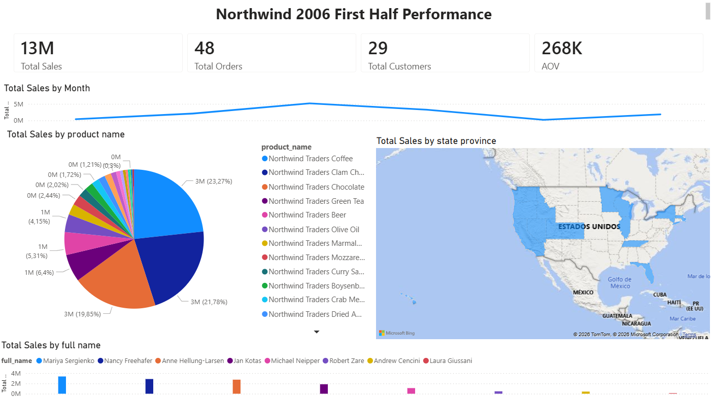

# Northwind 2006 First Half Sales Analysis

## Overview
This project analyzes sales data from the Northwind database (first half of 2006) using SQL and Power BI to identify business trends and key performance indicators.

## Tools
- MySQL
- Power BI

## Key KPIs
- Total Sales: $13M
- Total Orders: 48
- Total Customers: 29
- Average Order Value (AOV): $268K

## Key Insights
- Top Products: Northwind Traders Coffee, Clam Chowder, and Chocolate account for the highest sales (top 3 contributing ~64% of total sales).
- Sales by Category: Beverages and Seafood are the main revenue contributors.
- Monthly Trend: Sales show a peak in the middle of the semester, followed by a slight decrease toward the end of June.
- Employee Performance: Sales by employee vary, with some employees contributing significantly more to total sales than others.

## Dashboard

## Author
Santiago Acosta Barriga
Data Analyst | SQL | Power BI
